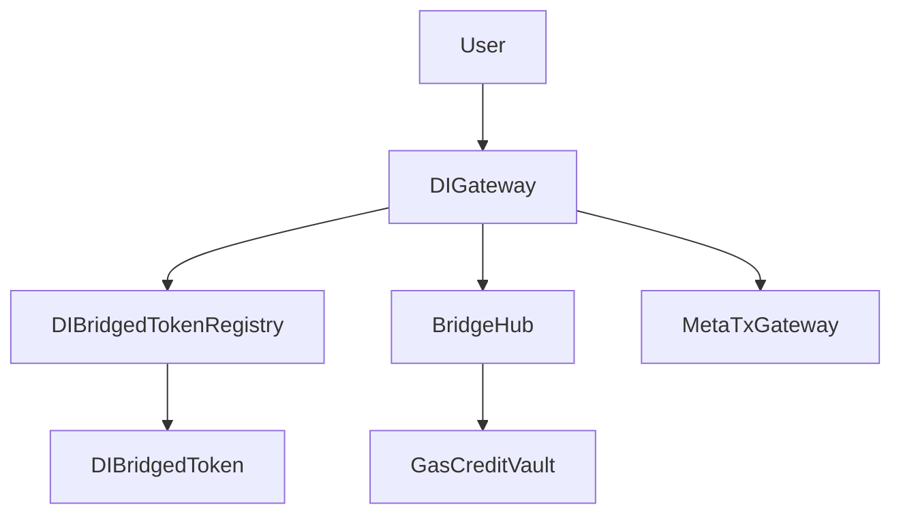

# Core Contracts

The DI-Contracts protocol consists of several key smart contracts that work together to enable cross-chain bridging.

## DIGateway

**Purpose**: Main user interface for cross-chain operations
**Location**: Deployed on each supported chain

### Key Features
- Token transfers across chains
- Contract calls with optional token transfers
- Command execution for relayers
- Fee management

### Core Functions
```solidity
function sendToken(uint32 destinationChainId, address destinationAddress, string memory symbol, uint256 amount)
function callContract(uint32 destinationChainId, address destinationContractAddress, bytes memory payload)
function callContractWithToken(uint32 destinationChainId, address destinationContractAddress, bytes memory payload, string memory symbol, uint256 amount)
```

## BridgeHub

**Purpose**: Central coordination hub
**Location**: Deployed only on HyperEVM (hub chain)

### Key Features
- Chain registry management
- Token registry coordination
- Event logging and monitoring
- Cross-chain state synchronization

### Core Functions
```solidity
function addChain(uint32 chainId, string memory name, string memory rpcUrl, address gatewayAddress)
function addToken(string memory symbol, string memory name, uint8 decimals)
function logBridgeEvent(bytes32 eventId, uint32 sourceChainId, uint32 destinationChainId, ...)
```

## DIBridgedTokenRegistry

**Purpose**: Token management and registry
**Location**: Deployed on each supported chain

### Key Features
- Token deployment and management
- Lock/unlock native tokens
- Mint/burn bridged tokens
- Token metadata storage

### Core Functions
```solidity
function deployToken(string memory symbol, string memory name, uint8 decimals, uint32 originChainId)
function lockToken(string memory symbol, address from, uint256 amount)
function unlockToken(string memory symbol, address to, uint256 amount)
function mintToken(string memory symbol, address to, uint256 amount)
function burnToken(string memory symbol, address from, uint256 amount)
```

## DIBridgedToken

**Purpose**: ERC20 implementation for bridged tokens
**Location**: Created by TokenRegistry when needed

### Key Features
- Standard ERC20 functionality
- Mint/burn capabilities for registry
- Origin chain tracking
- Metadata management

## MetaTxGateway

**Purpose**: Meta-transaction support for gasless operations
**Location**: Deployed on each supported chain

### Key Features
- EIP-712 signature verification
- Gasless token transfers
- Nonce management
- Relay fee handling

## GasCreditVault

**Purpose**: Gas credit management for cross-chain operations
**Location**: Deployed on hub chain (HyperEVM)

### Key Features
- Gas credit deposits
- Cross-chain gas estimation
- Automatic gas payment
- Credit balance tracking

## Contract Interactions



## Deployment Dependencies

1. **DIBridgedToken** (template)
2. **DIBridgedTokenRegistry**
3. **DIGateway**
4. **BridgeHub** (hub chain only)
5. **GasCreditVault** (hub chain only)
6. **MetaTxGateway**